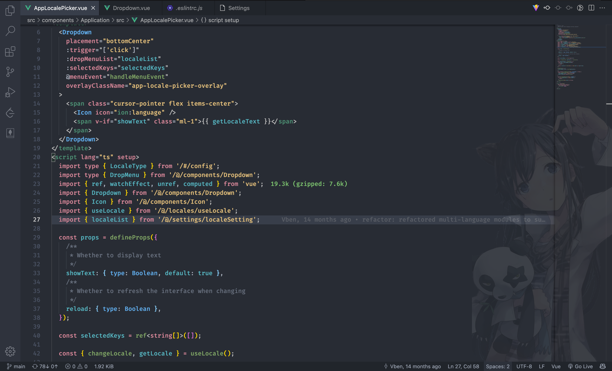

<h1 align="center">R_h_zero Theme for VS Code</h1>

## Thanks

This project is based on [github-vscode-theme](https://github.com/primer/github-vscode-theme).

This project is Anthony Fu vitesse Theme on 
[vitesse](https://github.com/antfu/vitesse) 
